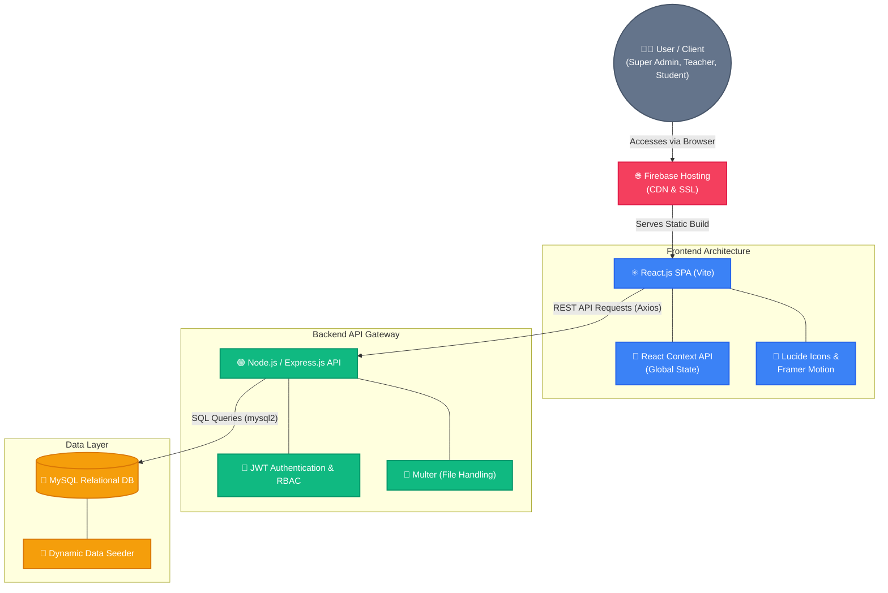

# 🚀 EduPro School Management System (Full-Stack)

Welcome to the **EduPro School Management System**, an elite, high-fidelity enterprise-grade full-stack portal built with modern web technologies, sleek aesthetics, and dynamic database connectivity.

---

## 🔗 Live Application & Repository

- **🌐 Live Demo (Firebase Hosting)**: [https://edupro-school-portal.web.app](https://edupro-school-portal.web.app)
- **💻 GitHub Repository**: [https://github.com/Sg-2003/school-management-system](https://github.com/Sg-2003/school-management-system)

---

## 🏗️ System Architecture & Structural Diagram

The EduPro platform utilizes a modern decoupled full-stack architecture. The React frontend communicates asynchronously with a secure Express.js API Gateway, which interfaces with a highly structured MySQL relational database.



---

## 🛠️ Technology Stack

- **Frontend Client**: React.js (Vite), Lucide Icons, Recharts, Framer Motion, Axios.
- **Backend Server**: Node.js, Express, JSON Web Tokens (JWT), MySQL.
- **Database Engine**: MySQL / MariaDB (via XAMPP, Laragon, or standalone service).
- **Hosting**: Firebase Hosting (Frontend).
- **Styling**: Premium custom Vanilla CSS with modern UI layouts, glassmorphism, 3D book covers, and responsive structures.

---

## 🌟 Key Features

1. **🔒 Secure Authentication & Role-Based Access Control (RBAC)**
   - Dynamic portals with custom dashboards for **Super Admins**, **Teachers**, **Students**, and **Parents**.
2. **📋 Student & Teacher Directories**
   - Active, inactive, and suspended profiles with high-fidelity local assets and uniform student headshots.
3. **📊 Unified Academic & Financial Dashboards**
   - Live fee ledger logging, collection analytics via interactive charts, and predictive AI financial modelers.
4. **📅 Logistics Modules**
   - **Hostel Allotments**: Monitor room number block occupancies.
   - **Transportation Registry**: Route logging and active bus drivers.
   - **Library & E-Library**: Book catalog status updates with premium 3D CSS rendering and OpenLibrary API integrations for authentic covers.
5. **🔔 Real-Time Announcements**
   - Direct database-driven Notice Board for broadcasting school-wide events and academic updates.

---

## 📂 Comprehensive Folder Structure

```text
School Management System/
│
├── school-management-frontend/       # ⚛️ React Client Portal (Vite)
│   ├── public/                       # Static public assets
│   ├── src/
│   │   ├── assets/                   # High-fidelity images, avatars, illustrations
│   │   ├── components/               # 🧩 Reusable UI widgets (Topbar, Sidebar, Table, Modal)
│   │   ├── layout/                   # 🏗️ Page layouts (MainLayout)
│   │   ├── pages/                    # 📄 Core pages (Dashboard, Library, Fees, Timetable, etc.)
│   │   ├── services/                 # 🌐 API services & Axios network interceptors
│   │   ├── context/                  # 🔄 Global state context providers
│   │   ├── App.jsx                   # Application router wrapper
│   │   ├── index.css                 # Premium custom Vanilla CSS and glassmorphism styling
│   │   └── main.jsx                  # React application entry point
│   ├── .env                          # Frontend environment variables
│   ├── index.html                    # HTML document entry
│   ├── package.json                  # Frontend dependencies
│   └── vite.config.js                # Vite build configurations
│
├── school-management-backend/        # 🟢 Express API Gateway
│   ├── config/                       # Database configuration & dynamic seeder (dbInit.js, db.js)
│   ├── controllers/                  # 🎮 Route controller logic
│   ├── middleware/                   # 🛡️ JWT Authentication & Validation logic
│   ├── routes/                       # 🛣️ Express route definitions
│   ├── uploads/                      # 📁 Local storage for Multer file uploads
│   ├── database.sql                  # Raw MySQL schema definitions (DDL)
│   ├── server.js                     # 🚀 Main backend entry point
│   ├── .env                          # Backend environment variables
│   └── package.json                  # Backend dependencies
│
├── firebase.json                     # Firebase deployment configuration
├── .firebaserc                       # Firebase project target aliases
├── .gitignore                        # Ignored git files and cache directories
└── README.md                         # Project documentation (You are here!)
```

---

## 🚀 Setup & Launch Instructions

### 1. Database Setup
1. Open your MySQL server control panel (e.g., **XAMPP Control Panel** or **Laragon**).
2. Start the **Apache** and **MySQL** services.
3. Ensure MySQL is running. If your port is `3306` or `3307`, it will be detected automatically based on the backend `.env` configuration.

### 2. Configure & Start the Backend Server
1. Navigate to the backend directory:
   ```bash
   cd school-management-backend
   ```
2. Verify that the `.env` settings align with your MySQL environment. For XAMPP running on port `3307`, specify `DB_PORT=3307`:
   ```env
   PORT=5000
   DB_HOST=127.0.0.1
   DB_PORT=3307
   DB_USER=root
   DB_PASSWORD=
   DB_NAME=school_db
   JWT_SECRET=yoursecretkey123
   ```
3. Install dependencies and start the server:
   ```bash
   npm install
   npm run dev
   ```
   *Note: On launch, the server runs on `http://localhost:5000` and automatically builds/seeds the tables with rich high-fidelity demo records.*

### 3. Configure & Start the Frontend Portal
1. Navigate to the frontend directory:
   ```bash
   cd ../school-management-frontend
   ```
2. Install client dependencies and launch the dev environment:
   ```bash
   npm install
   npm run dev
   ```
3. Open `http://localhost:5173` in your browser to explore the portal!

---

## 🧪 Deployment to Firebase Hosting

To build and deploy the frontend application to Firebase Hosting:

1. **Build the production assets from the frontend directory**:
   ```bash
   cd school-management-frontend
   npm run build
   ```
2. **Authenticate with Firebase (if not already logged in)**:
   ```bash
   npx firebase-tools login
   ```
3. **Deploy the application from the ROOT directory**:
   ```bash
   cd ..
   npx firebase-tools deploy --only hosting
   ```
   The application will be uploaded and accessible online at [https://edupro-school-portal.web.app](https://edupro-school-portal.web.app).
